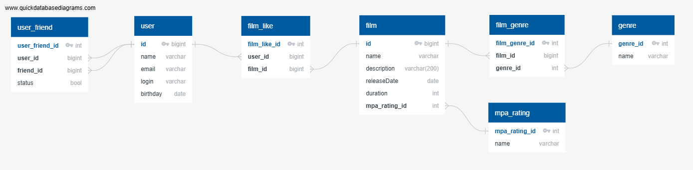

# java-filmorate
Template repository for Filmorate project.


## Database ER diagram (ver.1 sprint 12)



## Запросы на получение данных

- getAllFilms:
  ``SELECT * FROM film;``

- getAllUsers:
  ``SELECT * FROM user;``

- getTopFilms:
```sql
SELECT f.id, f.name, f.description, f.releaseDate, f.duration, COUNT(fl.user_id) AS count
FROM film f
LEFT OUTER JOIN film_like AS fl ON f.id = fl.film_id
GROUP BY f.id
ORDER BY count DESC
LIMIT 10;
```
- getAllFriendsById:
```sql
SELECT *
FROM user AS u
-----
```
- getAllCommonFriendsByIds:
```sql
SELECT u_f1.friend_id
FROM user_friend AS u_f1
LEFT OUTER JOIN user_friend AS u_f2 ON u_f1.friend_id = u_f2.friend_id
WHERE u_f1.user_id = ID1 AND u_f2.user_id = ID2
AND u_f1.status = true
AND u_f2.status = true;