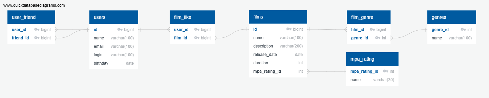

# java-filmorate
Template repository for Filmorate project.


## Database ER diagram (ver.2 sprint 12)



## Описание таблиц


```
user
--
id bigint PK
name varchar(100)
email varchar(100)
login varchar(100)
birthday date


user_friend
--
user_id bigint PK FK >- user.id
friend_id bigint PK FK >- user.id


film_like
--
user_id bigint PK FK >- user.id
film_id bigint PK FK >- film.id


film
--
id bigint PK
name varchar(100)
description varchar(200)
release_date date
duration int
mpa_rating_id int FK >- mpa_rating.mpa_rating_id


film_genre
--
film_id bigint PK FK >- film.id
genre_id int PK FK >- genre.genre_id


genre
--
genre_id int PK
name varchar(100)


mpa_rating
--
mpa_rating_id int PK
name varchar(100)
```